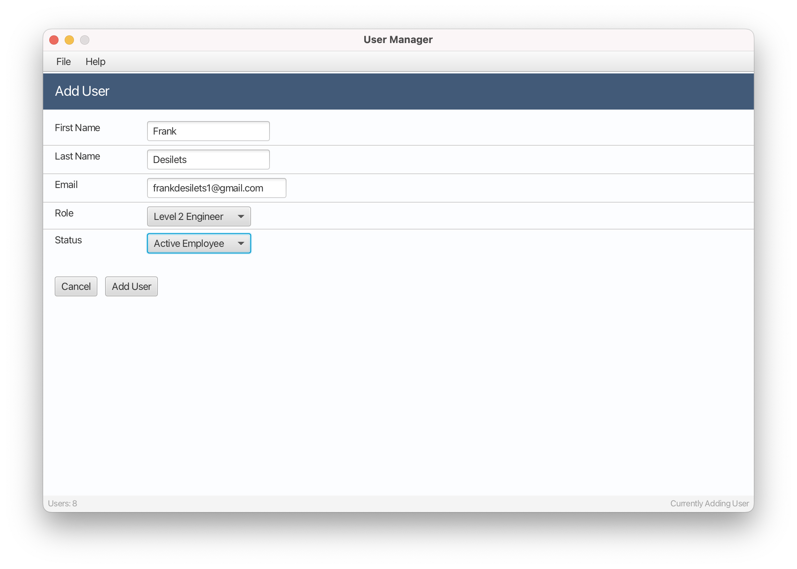
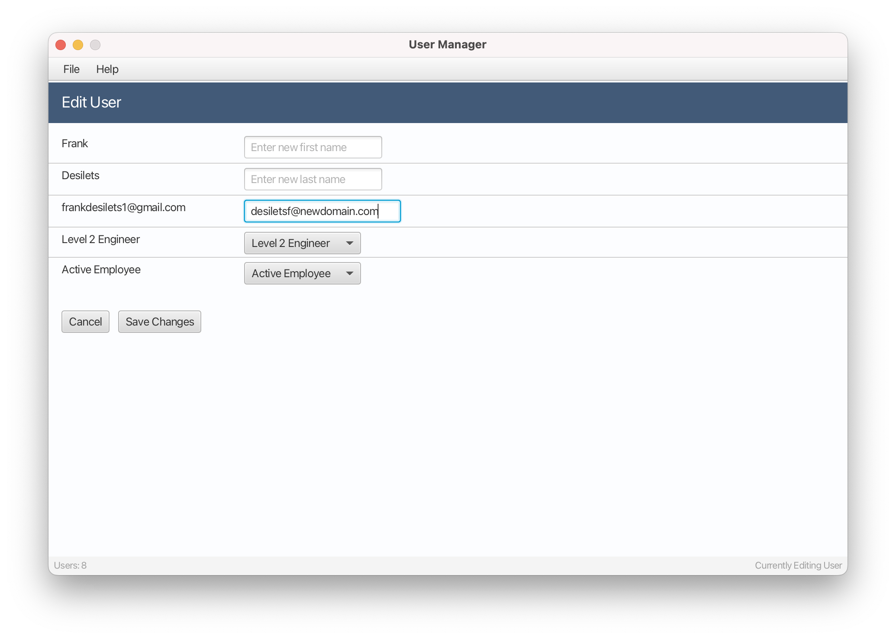
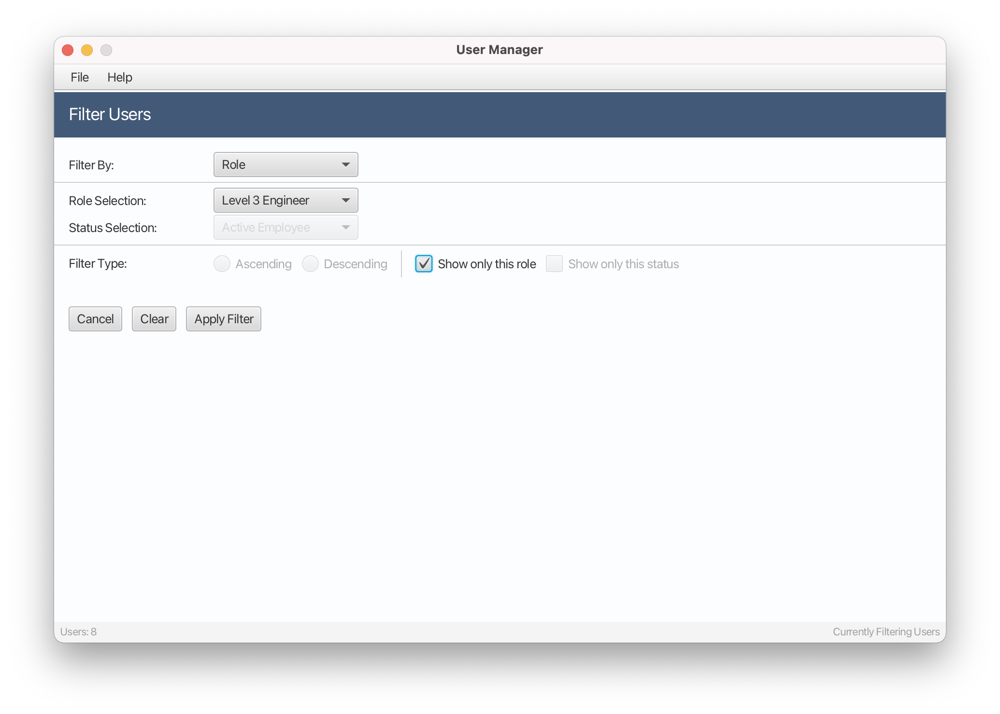

 

# User-Manager-GUI
This graphical user interface simulates user account management in a professional internal system, built as a personal project to practice UI/UX concepts.

## Project Description
The main view of the GUI is the Dashboard. User accounts and their properties are displayed in a table, one user per row, and controls are provided to add, delete, edit, filter, or search for users. Users are sorted in descending order by Role by default. There are three supporting views: the Filter User form, used to apply filters to the user list populating the table, the Add User form, used to add a new user to the system, and the Edit User form, used to edit an existing user of the system. 

The UI was built with JavaFX 22.0.1 and Scene Builder (a visual layout tool). I used JavaFX to give the application a modern look and feel (as opposed to Java Swing), and Scene Builder to design and easily manage the components of the UI. Maven was used as the build automation tool. I developed the application with Eclipse IDE 2023-12 4.30.0.

## Motivation
I built this user interface to showcase skills related to user interface design and development, including the use of JavaFX, Scene Builder, Maven, and CSS stylesheets, and to practice concepts I learned in my Algorithms class. I am passionate about UI/UX and used this project to learn more about design centered around user experience. 

## Features
-	User Properties
    - Email/ID (an account's unique identifier), First Name, Last Name, Role (a user's position in an organization, for example “Level 3 Engineer”), and Status (a user's account activity, for example “Active Employee”).
-	Add Users
-	Delete Users
-	Edit Users
-	Filter Users
-	Search Users
    - Searching is not case sensitive.
-	Use of a .txt file for user storage
    - User modification is written in real-time to a .txt file. Each user property is separated by a comma delimiter, one account per line. Upon application launch, the file is parsed and a main user list is populated.

## How to Install and Run

1. Clone and import the repository to your Java IDE workspace. Because JavaFX is a Maven dependency, it should not need to be added to the build path.
3. Run the project (the main method is located in src/main/java/frankdesilets.User_Manager/UserManager.java).

NOTE: I have run into a bug in JavaFX where on application launch an IllegalStateException is thrown stating that the location is not set. This is fixed by simply navigating to line 30 of UserManager.java and re-typing "main" in the loadFXML() method parameter and re-running. I also experienced an issue where JavaFX version 22.0.1 could not be run in the 2024 version of Eclipse, and when downgrading back to Eclipse 2023-12 4.30.0 the issue was fixed.

## How to Use

### Dashboard

User accounts are managed in the Dashboard and their properties are listed in the table, one user per row. User properties include Email/ID (an account's unique identifier), First Name, Last Name, Role (a user's position in an organization, for example “Level 3 Engineer”), and Status (a user's account activity, for example “Active Employee”). Users are sorted in decending order by Role by default. 

A user can be edited or deleted by interacting with that user’s “Edit” combo box (in the far-right column of the table) and choosing the appropriate option, as shown above. A user is deleted when “Delete User” is selected, and the view is switched to the Edit User form when “Edit User” is selected, which enables an existing user of the system to have their properties changed.

There are several controls along the right of the blue Dashboard header. The “Filter” button switches the view to the Filter User form, which enables filters to be applied to the user list populating the table. The text field to the right of the “Filter” button enables searching for a user in the table. The “Clear” button to the right of the text field clears the search input and currently applied filters (it also resets the Filter User form), resetting the table to display all current users in descending order by role (the default sort method). The “Add User” button on the far-right switches the view to the Add User form, which enables a new user to be added to the system.

### Add User Form

This form enables a new user to be added to the system. It is accessed by pressing the "Add User" button located on the Dashboard. Controls are provided to input user properties. On attempted addition of a new user (the “Add User” button is pressed), the inputting email is checked to be formatted correctly and unique (it cannot already be associated with another account).

There are two buttons at the bottom of the form. The “Cancel” button resets the form and switches the view back to the Dashboard without adding the user. The “Add User” button creates a new user with inputted information and adds the user to the system (the user is added to the Dashboard user table and written to the .txt storage file). The form is reset and the view is switched to the Dashboard. 

### Edit User Form

This form enables a current user in the system to have their properties edited. It is accessed by selecting "Edit User" in a user’s “Edit” combo box (in the far-right column of the Dashboard user table). Controls are provided to input updated user properties. On attempted editing of a new user (the “Save Changes” button is pressed), the inputting email is checked to be formatted correctly and unique (it cannot already be associated with another account).

There are two buttons at the bottom of the form. The “Cancel” button resets the form and switches the view back to the Dashboard without editing the user. The “Save Changes” button updates the user properties with the inputted information and the .txt storage file. The form is reset and the view is switched to the Dashboard. 

### Filter User Form

This form enables filters to be applied to the user list populating the Dashboard user table. It is accessed by pressing the "Filter" button located on the Dashboard. The “Filter by” choice box enables selection of which user property to filter by. The remaining fields are specific to the property selected (and are enabled or disabled based on the property selected). For example, the “Ascending” and “Descending” radio buttons are only applicable to filtering by Email/ID, First Name, or Last Name, as they sort the selected property in reverse-lexicographic and lexicographic order, respectively; it is not useful to sort the role and status types in this way as roles are ordered by role type, i.e., Manager and Engineer, and status is order by account activity, i.e., Active Employee, Inactive Employee, Disabled Account.

There are three buttons at the bottom of the form. The “Cancel” button resets the form and switches the view back to the Dashboard without applying any filters. The “Clear” button resets the form (and clears the current filter) without switching back to the Dashboard, and the “Apply Filter” button applies the configured filter to the Dashboard user table and switches the view back to the Dashboard, without resetting the form.
